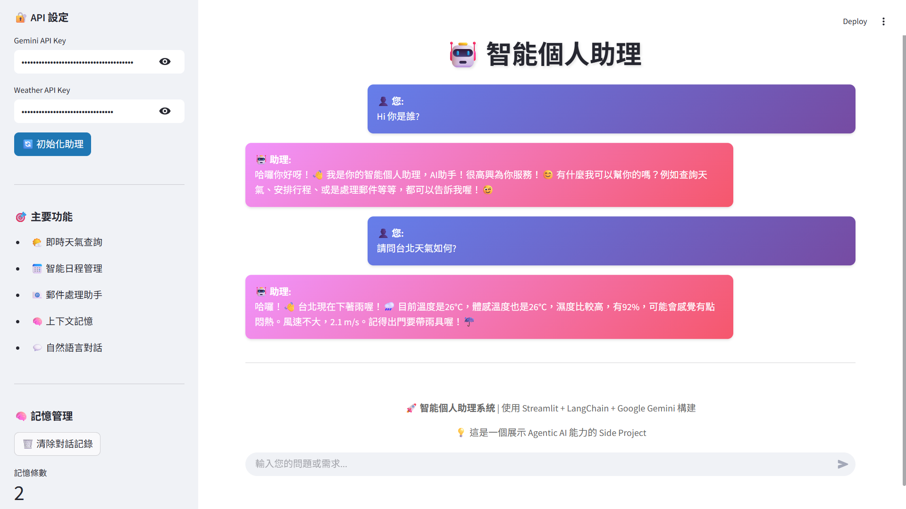

# 🤖 Intelligent Personal Assistant System

An Agentic AI personal assistant powered by Google Gemini 2.0 Flash, demonstrating advanced decision-making and tool integration capabilities of modern AI agents.

---

## 🎯 Project Features

### 🧠 Agentic AI Architecture

- **Intelligent Intent Recognition:** Automatically detects user needs and selects appropriate tools.
- **Contextual Memory:** Remembers conversation history and user preferences.
- **Multi-Tool Integration:** Practical features such as weather, calendar, email, and more.
- **Natural Language Interaction:** Supports conversations in Traditional Chinese.

---

## ⚡ Core Functions

- 🌤️ **Real-Time Weather Query:** Get global city weather information and recommendations.
- 📅 **Smart Schedule Management:** Arrange, view, and manage personal events.
- 📧 **Email Handling Assistant:** Read, compose, and reply to emails.
- 🧠 **Memory & Learning:** Remembers user preferences to provide personalized services.
- 💬 **Natural Conversation:** Smooth conversational experience in Chinese.

---

## 📸 System Showcase



### Main Interface

🤖 **Intelligent Personal Assistant**

| 🌤️ Weather Service                   | 📅 Schedule Management        | 🧠 Intelligent Memory                              |
|---------------------------------------|------------------------------|---------------------------------------------------|
| Get real-time weather info for any city | Smartly manage your schedule | Remembers our conversation history and offers personalized suggestions |

### Conversation Example

> **User:** “What’s the weather like in Taipei today? Schedule a client meeting at 2pm tomorrow.”  
> **Assistant:**  
> 🌤️ Taipei Weather Info  
> 🌡️ Temperature: 22°C (Feels like 24°C)  
> ☁️ Condition: Cloudy ⛅  
> 💧 Humidity: 65%  
>  
> ✅ Event successfully added!  
> 📋 Event Details:  
> 🎯 Title: Client Meeting  
> 📅 Date: 2024-06-13  
> ⏰ Time: 2:00 PM  

---

## 🛠️ Technical Architecture

### Core Tech Stack

- **Frontend Framework:** Streamlit 1.28.1
- **AI Model:** Google Gemini 2.0 Flash
- **Backend Language:** Python 3.9+
- **API Integration:** OpenWeatherMap, Google Generative AI
- **Data Processing:** Pandas, JSON
- **Deployment Platform:** Streamlit Cloud

### System Architecture

```
┌─────────────────┐    ┌──────────────────┐    ┌─────────────────┐
│   Streamlit     │    │   Agent Core     │    │   Tool System   │
│   Frontend      │◄──►│   (Gemini 2.0)  │◄──►│ Weather/Calendar/Email │
│   UI            │    │ Decision Engine  │    │ External API    │
└─────────────────┘    └──────────────────┘    └─────────────────┘
                                │
                                ▼
                       ┌──────────────────┐
                       │  Memory System   │
                       │  Memory Manager  │
                       └──────────────────┘
```

### Design Patterns

- **Agent Pattern:** The assistant acts as a proxy between the user and various tools.
- **Strategy Pattern:** Selects different processing strategies based on detected intent.
- **Observer Pattern:** Memory system listens to conversations and learns automatically.
- **Factory Pattern:** Dynamically creates and manages different types of tools.

---

## 🔧 Local Development

### Quick Start

```bash
# 1. Clone the project
git clone https://github.com/your-username/agentic-ai-assistant.git
cd agentic-ai-assistant

# 2. Create virtual environment
python -m venv venv
source venv/bin/activate  # Mac/Linux
# venv\Scripts ctivate   # Windows

# 3. Install dependencies
pip install -r requirements.txt

# 4. Set environment variables
cp .env.example .env
# Edit the .env file and add your API keys

# 5. Run the application
streamlit run app.py
```

### Environment Variables

```env
GEMINI_API_KEY=AIzaSyxxxxxx-your-gemini-api-key
WEATHER_API_KEY=your-openweathermap-api-key
```

### Getting API Keys

- **Gemini API:** Google AI Studio
- **Weather API:** OpenWeatherMap

---

## 📋 Feature Demonstrations

- 🌤️ **Weather Query**  
  *User:* “What’s the weather like in Tokyo?”  
  *Assistant:* Provides detailed weather info, temperature, humidity, wind speed, and lifestyle suggestions.

- 📅 **Schedule Management**  
  *User:* “Schedule a product meeting at 10 am tomorrow.”  
  *Assistant:* Intelligently parses the time, creates the event, and provides reminders.

- 📧 **Email Handling**  
  *User:* “Show me unread emails.”  
  *Assistant:* Displays a list of emails, categorizes by priority, and offers action suggestions.

- 🧠 **Memory & Learning**  
  *User:* “I live in Taipei and love coffee.”  
  *Assistant:* Remembers user preferences and provides personalized suggestions in future conversations.

---

## 💡 Technical Innovations

- **Agentic AI:** Demonstrates the autonomous decision-making ability of AI Agents.
- **Multimodal Integration:** Seamlessly combines text, APIs, and memory.
- **Chinese Optimization:** NLP processing optimized for Traditional Chinese.
- **Real-Time Interaction:** Smooth and interactive dialogue experience.

---

## 📄 License

This project is licensed under the MIT License.

---

## 👨‍💻 Developer

Roy  
📧 Email: royhker@gmail.com
